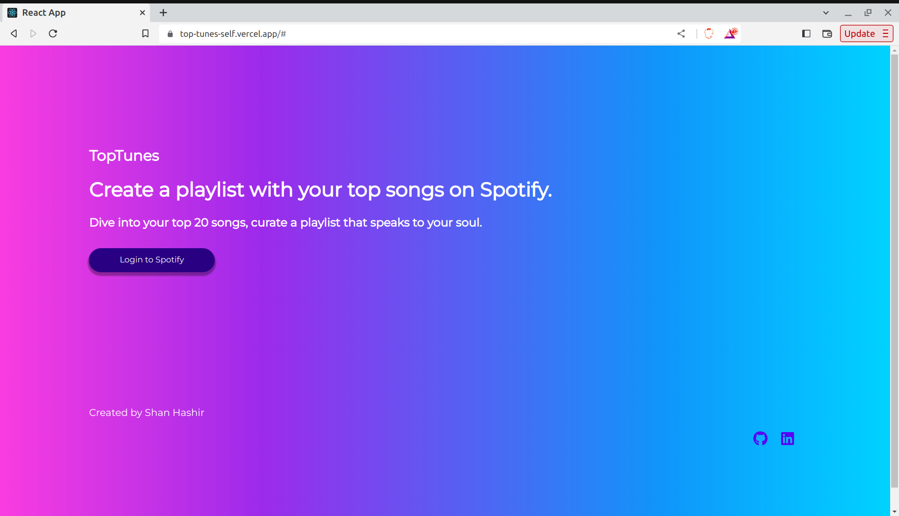
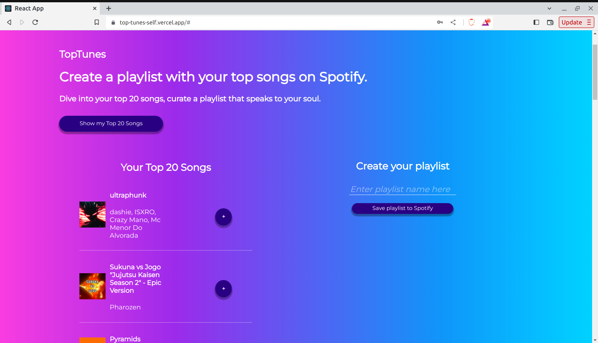
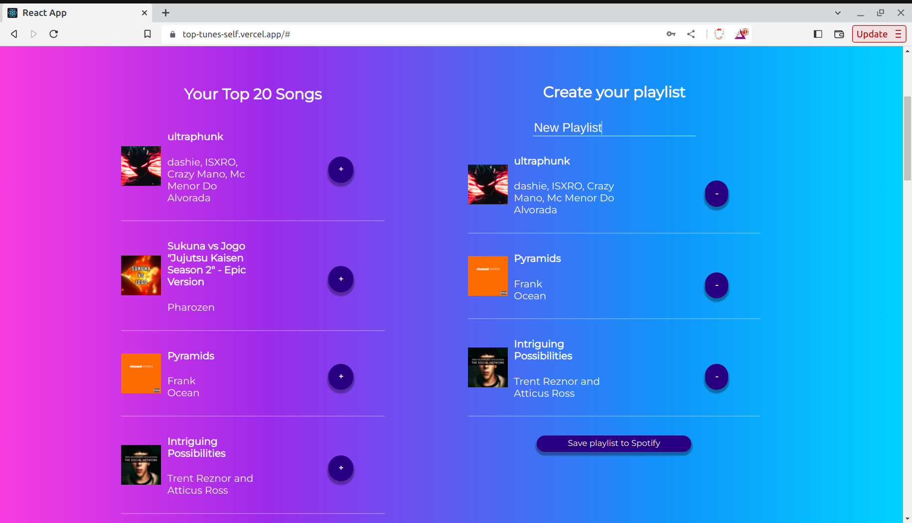
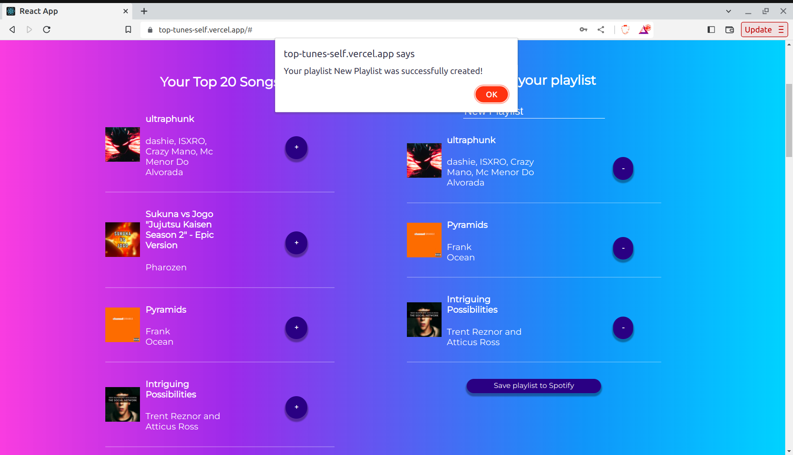

# TopTunes 

TopTunes is a React JS webapp that creates a Spotify playlist using songs that you select from your top 20 most listened songs.

Click <a href = "https://top-tunes-self.vercel.app/#">here </a> to try it out.

## Motivation

As a music lover, I often find myself repeatedly listening to my favorite songs. While Spotify lets you create playlists, it lacks a feature to highlight your top tracks. TopTunes was created as a solution to curate playlists from your top 20 songs, providing an easy way to enjoy your most-played tunes on repeat.

## Screenshots
### Opening page

### You Top 20 songs

### Add to playlist

### Save playlist to Spotify

## Project Outcomes
### ReactJS
This project allowed me to learn how to build a responsive and interactive UI using React and about creating components and managing state. 
### Spotify API
I learned how to use the Spotify API to make authenticated HTTP requests, to acquire user's top tracks, create playlists, retrieve user data etc. Through implementing <a href="https://developer.spotify.com/documentation/web-api/concepts/authorization">user authorization </a>for Spotify, I learnt about OAuth2.0, and the different flows for authorization. 